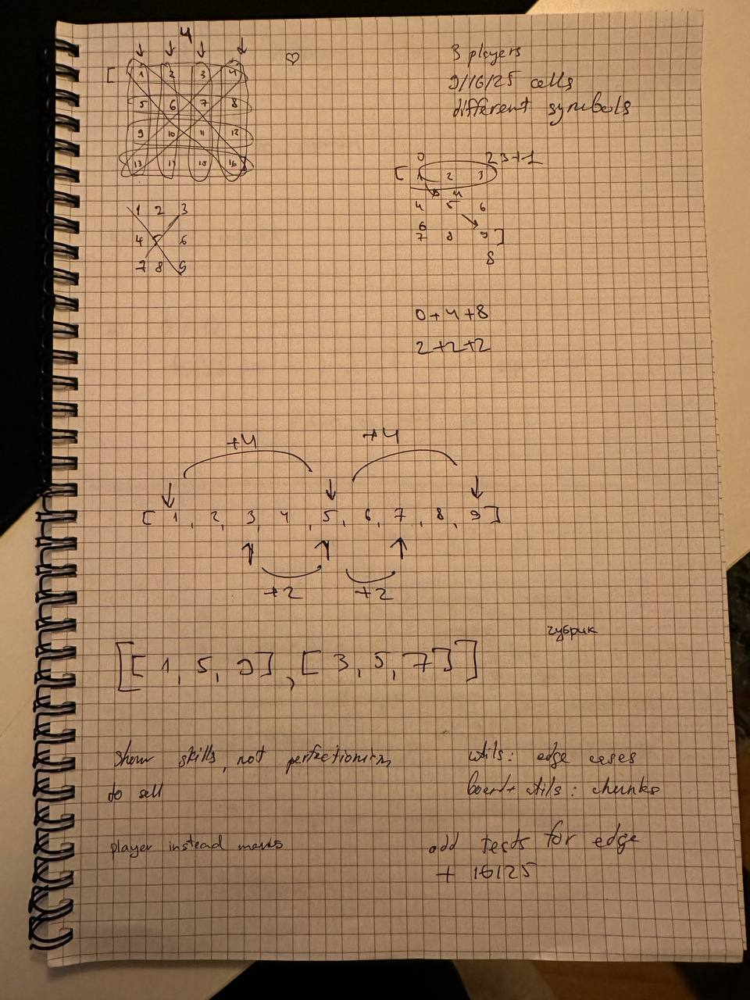

     _____ _         _____             _____
    |_   _(_) ___   |_   _|_ _  ___   |_   _|__   ___
      | | | |/ __|____| |/ _` |/ __|____| |/ _ \ / _ \
      | | | | (_|_____| | (_| | (_|_____| | (_) |  __/
      |_| |_|\___|    |_|\__,_|\___|    |_|\___/ \___|

`Tic-Tac-Toe` is a paper-and-pencil game for two players who take turns marking the spaces in a three-by-three grid with 
`X` or `O`. This repository contains the implementation of the game in terminal written in `Python`.

Table of Contents:

* [Rules](#rules)
* [Gameplay](#gameplay)
* [How To Play](#how-to-play)
* [Tech Design](#tech-design)
* [Intentions](#intentions)
* [Draft](#draft)

## Rules

1. The game is played on a grid that's 3 squares by 3 squares.
2. You are «x», your friend is «o». Players take turns putting their marks in empty squares.
3. The first player to get 3 of her marks in a row (up, down, across, or diagonally) is the winner.
4. When all 9 squares are full, the game is over. If no player has 3 marks in a row, the game ends in a tie.

More info: https://en.wikipedia.org/wiki/Tic-tac-toe

## Gameplay


## How To Play

Download the code cloning the repository locally and enter the folder:

```bash
$ git clone https://github.com/dmytrostriletskyi/tic-tac-toe.git
$ cd tic-tac-toe
```

Create a [virtual environment](https://virtualenv.pypa.io/en/latest/) and activate it (the code has been tested on 
`Python 3.11`, preferably use it, other versions can work too though):

```bash
$ virtualenv -p python3.11 ~/venvs/tic-tac-toe
$ source ~/venvs/tic-tac-toe/bin/activate
```

Adjust the name of the virtual environment folder(s). The author has a separate generic folder for all virtual 
environments (`~/venvs`), so the command reflects it. In your case, it can be different.

Depending on your environment, you might need to add the cloned folder to your `Python`'s path. Use the following 
command in advance or if you face `ModuleNotFoundError` error when running the game with the instructions below.

```bash
$ export PYTHONPATH="${PYTHONPATH}:$(pwd)"
```

Being in the folder, run the game executing `game/game_.py` file with `Python`:

```bash
$ python3 game/game_.py
```

You should experience the following output:

```bash
     _____ _         _____             _____
    |_   _(_) ___   |_   _|_ _  ___   |_   _|__   ___
      | | | |/ __|____| |/ _` |/ __|____| |/ _ \ / _ \
      | | | | (_|_____| | (_| | (_|_____| | (_) |  __/
      |_| |_|\___|    |_|\__,_|\___|    |_|\___/ \___|

————————————————————————————————————————————————————————————————

    1. The game is played on a grid that's 3 squares by 3 squares.
    2. You are «x», your friend is «o». Players take turns putting their marks in empty squares.
    3. The first player to get 3 of her marks in a row (up, down, across, or diagonally) is the winner.
    4. When all 9 squares are full, the game is over. If no player has 3 marks in a row, the game ends in a tie.

    More info: https://en.wikipedia.org/wiki/Tic-tac-toe

————————————————————————————————————————————————————————————————

     ¹ | ² | ³
    ———+———+———
     ⁴ | ⁵ | ⁶
    ———+———+———
     ⁷ | ⁸ | ⁹

Player x, enter a position:
```

To ensure the tests are passed, install the necessary requirements:

```bash
$ pip3 install -r requirements/tests.txt
```

And run the tests with `pytest`:

```bash
$ pytest tests
```

By the way, tests do not cover everything. Mostly, the «back-end» part of the game.

To ensure the code matches quality and is consistent, install the necessary requirements:

```bash
$ pip3 install -r requirements/dev.txt
```

And run the linters:

```bash
$ isort game --diff --check-only && darglint game && ruff check game
```

## Tech Design

There are 3 major components of the technical design:

* Board — represents the game's board itself (squares or cells) as a list of empty and non-empty elements. Very scalable
  solution being able to increase a size of a board (9, 16, 25 cells and so on) and number of players (1, 2, 3, 4 and 
  so on). Takes care of marking a particular cell by a particular player and checking its state (game in progress, a tie 
  or win).
* User Interface (UI) — represents printable strings to a terminal, such as the game name, rules and placeholders. Also, 
  contain a little UI-related logic to represent the board as a list into a printable string. It is not scalable, and
  was only designed to support a 9 cells board and 2 players so far.
* Game — combines both the board and UI logic and orchestrates them, and also handles edge cases. As bound to the UI, 
  also is not scalable part of the codebase. As bound to the UI, only designed to support a 9 cells board and 2 players 
  so far.

In general, each layer's code contains classes and functions documentation with an explanation of this or that intention
in case a code reviewer will find the code itself not readable in some parts. Do not hesitate to find the corresponding 
tests to understand it better if needed.

What can be improved, in general:

* More tests for all the layers.
* Make the UI and thus the game scalable: choose a size of the board, a number of players, players moves orders,
  personal marks instead of the default «x» and «o» and so on.
* Make the UI prettier (colors, indentations) and probably there is a room to improve the UX.

## Intentions

The main intentions of the technical design and the solution were not only to create the possibility of playing the game
in a terminal, but also to flex on how it can be done in a kind of scalable manner and well-maintained. 

It is intended to show the developer's skills in naming, programming principles and approaches, consistency and to 
reflect seniority as maximum as possible for a short period of time and material. 

## Draft

In case you are wondering about my thinking process and the game design on several levels, you can try to take a look at
my draft: 


